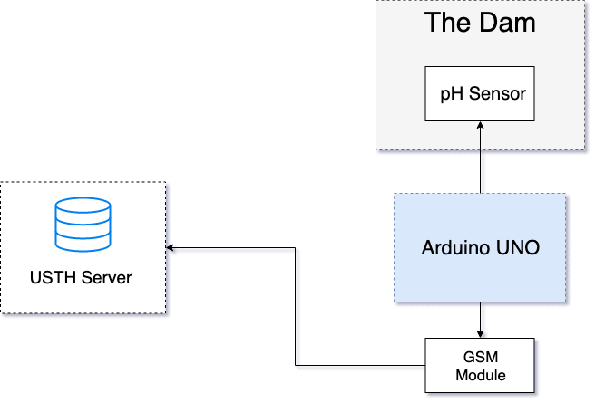

---
# pandoc intro.md -H preamble.tex -t beamer -o intro.pdf --slide-level=2
title:
- Water Nutrient Monitoring
author: 
- Do Hoang
date: \today{}
institute: 
-  University of Science And Technology of Hanoi 
theme:
- Ilmenau
colortheme:
- default 
innertheme:
- circles 
# outertheme:
# - miniframes 
header-includes:
- \newcommand{\hideFromPandoc}[1]{#1}
- \hideFromPandoc{
    \let\Begin\begin
    \let\End\end
  }
mainfont: sfdefault
toc: 
- true
---

# Introduction
## Introduction	
- Monitoring water quality
- Build IOT system to collect data
- Visualization of the data

# Our Work

## System Overview
{ width=75% } 

## Components: Sensors

\Begin{columns}
\Begin{column}{0.5\textwidth}

* Module Power: 5.00V
* Measuring Range: 0-14PH
* Measuring Temperature: 0-60 Celcius
* Accuracy:  0.1pH (25 Celcius)
* Response Time: <= 1min
* Industry pH Electrode with BNC Connector

\End{column}
\Begin{column}{0.5\textwidth}

\End{column}
\End{columns}

## Components: Arduino

\Begin{columns}
\Begin{column}{0.5\textwidth}

- Arduino UNO:
	- Microcontroller board
	- Provides electricity to the sensors
	- Collects data directly from the sensors
	- Delivers the data

\End{column}
\Begin{column}{0.5\textwidth}

\End{column}
\End{columns}

## Components: Communication

\Begin{columns}
\Begin{column}{0.5\textwidth}

* Module Power: 5-18VDC - >= 1A
* Communication Signal Level: TTL (3.3-5VDC) or RS232 
* Intergrated with IC RS232 MAX232
* Provide internet connection for Arduino

\End{column}
\Begin{column}{0.5\textwidth}

\End{column}
\End{columns}

## Data flow 

## Components 
- USTH Server:
	- Hosted by the ICTLab
	- Receives data via HTTP GET request
	- Manages database

# Results
## Results: Hardware

{ width=75% }

## Results: Software

# Future Plan
## Future Plan
- Better architecture
- Better energy consumption
- Better visualization
- Use more sensor type such as Electrical Conductivity(EC), Total dissolved solid (TDS), Salinity Sensors