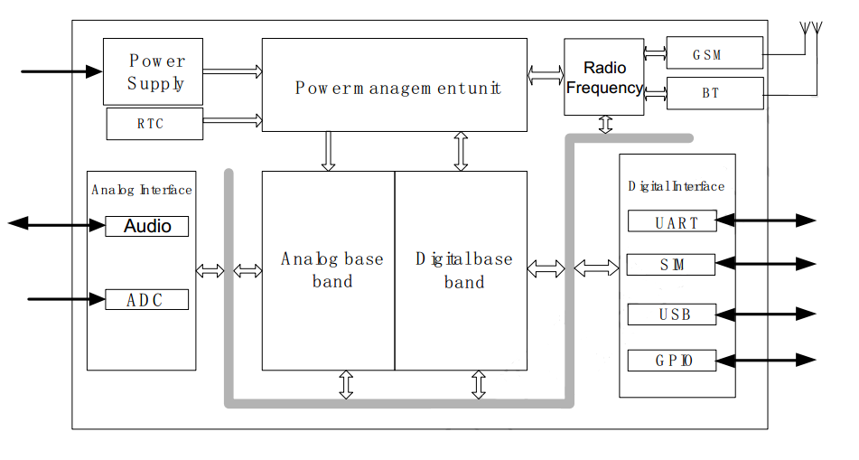
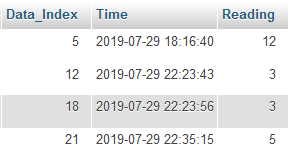

---
title: "Water Nutrient Monitoring"
author: 
- HOANG Duc Minh
- DO Duy Huy Hoang
date: \today
subject: "Bac Hung Hai Project"
...

\newpage{}
\tableofcontents
\newpage{}

## I. Analog pH Sensor/Meter

**Specification**

  * Module Power: 5.00V
  * Module Size: 43mmx32mm
  * Measuring Range: 0-14PH
  * Measuring Temperature: 0-60 Celcius
  * Accuracy:  0.1pH (25 Celcius)
  * Response Time: <= 1min
  * Industry pH Electrode with BNC Connector
  * PH2.0 Interface ( 3 foot patch )
  * Gain Adjustment Potentiometer
  * Power Indicator LED

* The output of pH electrode is in millivolts, and the pH value of the relationship is shown as follows (25 Celcius)
* pH = 7 - mV/ 57.14

| Voltage(mV) | pH value | Voltage(mV) | pHvalue |
|-------------|----------|-------------|---------|
| 414.12      | 0.00     | -414.12     | 14.00   |
| 354.96      | 1.00     | -354.96     | 13.00   |
| 295.80      | 2.00     | -295.80     | 12.00   |
| 236.64      | 3.00     | -236.64     | 11.00   |
| 177.48      | 4.00     | -177.48     | 10.00   |
| 118.32      | 5.00     | -118.32     | 9.00    |
| 59.16       | 6.00     | -59.16      | 8.00    |
| 0.00        | 7.00     | 0.00        | 7.00    |

**Connecting Diagram**

  \begin{figure}
  \centering
  {\includegraphics[width=2.4in]{pics/ph.png}}
  \caption{Connecting Diagram}
  \end{figure}

## II. Communication Protocol

**Sim800A** 

Sim800 uses 12V 2A or more power supply with stable performance because electric current for MIC29302AWU is 3A ( You can read about MIC29302AWU datasheet in [**here**](http://ww1.microchip.com/downloads/en/DeviceDoc/20005685A.pdf))
If the amperage is lower than 1A, it will happen to the case sim800 cannot recognize the sim card ( LED light will blink fast in sequence ). Otherwise, LED light will blink slower and with a delay.
GSM GPRS circuit Sim800A integrates pulse source and buffer ic designed for applications that require high durability and stability.

- Specification
  * GSM GPRS Sim800A
  * Module Power: 5-18VDC/ >= 1A
  * Communication Signal Level: TTL (3.3-5VDC) or RS232.
  * Intergrated with IC RS232 MAX232

**Sim800 Block diagram**
\
Basically sim800A supports a lot of different functions like read on ADC or Audio values. Digital pins are used for interfacing with other UART or USB devices in addition to the GPIO pins that are used for the purpose of the programmer. Signal strength depends on the reception of GSM antennas on the module.
\
\

\newpage{}
**Sim800 Schematic**
\
Sim800 is powered by **MIC29302AWU**, sim800 is connected to sim card via SIM800's C7 (I / O) - 15 (SIM_DATA) sim card for data transfer. C3 (CLK) - 16 (SIM_CLK) to carry data. C2 (RST) - 17 (SIM_RST) and C1 (VCC) - 18 (SIM_VDD). Pin 32 (GSM_ANT) is connected to the antenna. 
Notice the two pin number 1 (UART1_TXD) and the pin number 2 (UART1_RXD) to communicate with the microcontroller. Microcontroller will communicate with SIM800 with UART protocol, Sim800 communicates with SIM card via SIM_DATA pin.
\
 \begin{figure}
 \centering
 {\includegraphics[width=4.5in]{pics/2.png}}
 \caption{Schematic}
 \end{figure}

\newpage
**Sim800 Connecting Diagram**

 \begin{figure}
 \centering
 {\includegraphics[width=4.5in]{pics/sim800.png}}
 \caption{Connecting Diagram}
 \end{figure}
 
## III. Server Side 
 
After the having the reading from the sensor, it is transfered to a server in USTH via HTTP GET Request.

_http://scg.sontg.net/pH/insert_pH.php?val=8_

We created a small MySQL table to store the data for the test conducted during the first field trip. \
\

## IV. Field Trip Report

The objective of the first field trip was to deliver a test on the sensor and the communication protocol via GSM network. The data will be sent and stored in Bac Hung Hai's database and will be displayed in real-time.
\
As the purpose of the project is about monitoring water quality, we would also need more sensor type such as Electrical Conductivity(EC), Total dissolved solid (TDS), Salinity Sensors in addition to the pH sensor. 
\
For the next field trip, we are going to make a protection box to cover up both sensor and arduino board from the environment. The box will be put for testing for 2-3 days. 

